<!-- ═══════════════════════════════════════════════════════════════
     SUBBU-NAIDU // LIVING IDENTITY // v2027.0
     Repo: subbu-naidu/subbu-naidu (public)
     Files needed in repo root: README.md + profile-card.svg
     ═══════════════════════════════════════════════════════════════ -->

<div align="center">


<a href="https://github.com/subbu-naidu">
  
</a>

<br/>



<br/>


<br/><br/>

<a href="https://mrsubbunaidu.wixsite.com/my-site-3"></a>
<a href="https://www.linkedin.com/in/venkata-subbaiah-ch"></a>
<a href="https://github.com/subbu-naidu"></a>

</div>


<div align="center">

## `◢ 01 // IDENTITY.exe ◣`

</div>

```bash
$ whoami
> chennamsetty_venkata_subbaiah

$ cat /etc/identity
> USER      : venkata subbaiah chennamsetty
> ROLE      : AI/ML Engineer in the Making
> CLASS     : Full Stack Developer
> STATUS    : Data Science Student (2022 - 2027)
> MOTTO     : Building Useful Software in Public
> STATE     : ● ONLINE
```

<details>
<summary><b>▸ expand ASCII portrait</b></summary>

```text
                                   #++==--==++*#
                                +-%%           %%%=*
                              +%%...        ...... %%+
                            +-% ...              ....%%+
                          #===-..                  ....%-#
                         *-====:.                      ..%+
                        %%--...::..::       .:--:.      .:%@
                        #%   .         .-==+++++++-      .-@
                         = .  ===++++++*##%%%####*++-:.  %*
                         +=:=+##%%@@@@@@%%%%%%#**+*++*+-.%
                         *-+%#**++++=++*#%%#*+=====+++#*%+
                          =*%###**+===+*%%##+==+++++*###=
                          +*%%%*+*+=+++%%%%#*+=+==+++*##+
                        %@##%%%%%%#**#%%%%%##**+*******##%##
                       @*%#%%%%%%%%%%%%%@@%%###+*########*%+#
                       @*@#%%@@@@@%##%#*%%##*+*++*#%%%%%#+*+%
                        ##+*%%%@@%#*##*#***++++++=+*####+++%
                        @##+#%%%%%+++**#######*+=:+****++**
                         @%*+%%%%%++++#%%@@@%#*+=++#***++#@
                            ++##%%##%%%#*******#*+***+++
                             ++#%%%%%%%##*****#*****+++
                              =+*##%%%%%%%###****+++==
                              #+===++*****+++++==-.-+*
                              %%%*+=..   ...    .=+*##
                              %%%%%%*+=-.:---=++**#**#**
                            *=@%#%%%%%%##****####**#**@-+%
                          *=%+@@*#%%%%%%####*######*+@@=--+
                       *+=%=-+@@@**%%%%%##########*+@@@-==%-++#
                  #+=-%%:-===:%@@@*+*#%%########**+@@@+.=---:.%%=+*
              *+=%%...-=-----:=@@@@%++**#######***@@@@..:-----:.  %%-++#
         #++=%%.::::.:-:-----=.%@@@@@++***##%%#**@@@@* :..:::::. ..... %%=+*
    %*+=%%.:-----:......:----=:+@@%@@@*****#%%#%@@%%@=.:.....    .....:::..%%%=+#
  =-%.:---------:::..::----===--%@@@@@@#*****%@@@@%@*.::::..... .........::::.. %%
  %-------------:::..--:---====:+@@@@@@@@#*#@@@@@@@%=.::....:..  ...........:....%
 @%:---------------:..-----=====-%@@@@@@@@%@@@@@@@@*:-:::......  ........::::::..%
  -:-----===---------:-----=====-+@@@@@@@@@@@@@@@@%=:-:::::...  ..:::..:::::::::.%
  ==:========----==---:---=======-%@@@@@@@@@@@@@@@+:-:::::::.  ..::::::::::::::..%
  -=--==============---:--=======:+@@@@@@@@@@@@@@%=---::::::. ::.:::::::::..... .%
```

</details>


<div align="center">

## `◢ 02 // ABOUT_ME.sh ◣`

</div>

```yaml
# ~/about/subbu.yml
education:  B.Tech Data Science (2023-2027)
college:    Sri Mittapalli College of Engineering (Autonomous)
strong_in:  [Python, SQL/MySQL, DSA, OOPS, DBMS, OS, Computer Networks]
built:      End-to-end AI healthcare application using transfer learning
experience: Two AI & Machine Learning virtual internships (2025)
looking_for: [Software Engineer, AI/ML Engineer, Full Stack Developer]
languages:  [English, Telugu, Hindi]
motto:      "Building Useful Software in Public"
```


<div align="center">

## `◢ 03 // TECH_STACK.sys ◣`


<br/><br/>


</div>

```text
┌──────────────────────── SKILL_MATRIX ────────────────────────┐
│  LANGUAGES ...... Python · C · JavaScript                    │
│  AI / ML ........ TensorFlow · Scikit-Learn · Transfer Learn │
│  BACKEND ........ Flask · MySQL                              │
│  FRONTEND ....... HTML · CSS · Bootstrap                     │
│  TOOLS .......... Git · GitHub · VS Code                     │
│  CORE CS ........ DSA · OOPS · DBMS · OS · Networks          │
└──────────────────────────────────────────────────────────────┘
```


<div align="center">

## `◢ 04 // EXPERIENCE_TIMELINE.log ◣`

</div>

```text
  ●━━━━━━━━━━━━━━━━━━━━━━━━━━━━━━━━━━━━━━━━━━━━━━━━━━━━━━━━━━●
  ┃
  ┣━━ [ 2025 · MAY - JUL ] AI & Machine Learning Virtual Intern
  ┃       @ SmartInternz
  ┃       ▸ Built and tested Python-based ML solutions
  ┃       ▸ Worked on real-world datasets; sharpened debugging
  ┃
  ┣━━ [ 2025 · JUN - AUG ] AI & Machine Learning Virtual Intern
  ┃       @ HMIES Solution Pvt. Ltd.
  ┃       ▸ Data preprocessing and model development in Python
  ┃       ▸ Applied ML techniques; Git for version control
  ┃
  ┗━━ [ NOW ] B.Tech Data Science · Class of 2027
          ▸ Shipping projects · Learning in public
```


<div align="center">

## `◢ 05 // FEATURED_PROJECTS.dir ◣`

</div>

<table align="center" width="100%">
<tr>
<td width="50%" valign="top">

### 🩸 [HematoVision](https://github.com/subbu-naidu/hematovision)
**Advanced Blood Cell Classification using Transfer Learning**

End-to-end AI healthcare application that classifies blood cell images.


`STATUS: ● DEPLOYED` · `DOMAIN: AI HEALTHCARE`

</td>
<td width="50%" valign="top">

### 📚 [Library Management System](https://github.com/subbu-naidu?tab=repositories&q=Library)
**Full stack web app**

User authentication, book catalog management, issue/return tracking and an admin dashboard.


`STATUS: ● ONLINE` · `DOMAIN: FULL STACK`

</td>
</tr>
<tr>
<td width="50%" valign="top">

### ❤️ [Heart Disease Prediction](https://github.com/subbu-naidu?tab=repositories&q=Heart)
**Machine learning risk predictor**

Data preprocessing, analysis, model evaluation and optimization.


`STATUS: ● ONLINE` · `DOMAIN: ML / HEALTH`

</td>
<td width="50%" valign="top">

### ✈️ [Trip Planning Dashboard](https://github.com/subbu-naidu?tab=repositories&q=Trip)
**Interactive travel dashboard**

Responsive travel planning dashboard with recommendation features.


`STATUS: ● ONLINE` · `DOMAIN: FRONTEND`

</td>
</tr>
</table>


<div align="center">

## `◢ 06 // GITHUB_STATS.dash ◣`


<br/>

## `◢ 07 // STREAK_ENGINE.run ◣`


<br/>

## `◢ 08 // CONTRIBUTION_GRAPH.live ◣`


<br/>

## `◢ 09 // TROPHY_BOARD.vault ◣`


</div>


<div align="center">

## `◢ 10 // CERTIFICATIONS.vault ◣`

</div>

```text
  📜  IBM AI & Machine Learning Program
  📜  Machine Learning with Python ........ Simplilearn
  📜  Python Programming .................. Simplilearn
  📜  APSCHE SmartInternz Internship Program
  📜  Web Development ..................... MentIBy
  📜  Python Full Stack Workshop .......... ThinkChamp
  🏅  Deployed an end-to-end AI healthcare application
  🏅  Completed AI/ML and Web Development internships
```


<div align="center">

## `◢ 11 // CURRENT_FOCUS.status ◣`

</div>

<table align="center" width="100%">
<tr>
<td width="33%" valign="top">

#### 📡 LEARNING
```diff
+ Data Structures & Algorithms
+ Machine Learning
+ Full Stack Development
+ System Design
```

</td>
<td width="33%" valign="top">

#### 🛠️ BUILDING
```diff
! AI Healthcare Applications
! Full Stack Projects
! Open-source Contributions
```

</td>
<td width="33%" valign="top">

#### 🎯 SEEKING
```diff
- Software Engineer Roles
- AI/ML Engineer Roles
- AI/ML Internships
```

</td>
</tr>
</table>

```bash
$ ./open_to_collaborate --list
> 🌐 Open-source projects
> 💼 Freelance opportunities
> 🔬 Research projects
> 💡 Startup ideas
```


<div align="center">

## `◢ 12 // CONNECT.sh ◣`

<a href="https://www.linkedin.com/in/venkata-subbaiah-ch"></a>
<a href="https://mrsubbunaidu.wixsite.com/my-site-3"></a>
<br/>
<a href="https://github.com/subbu-naidu"></a>
<a href="mailto:mrsubbunaidu@gmail.com"></a>

<br/><br/>

```bash
$ ping subbu-naidu --collab
> PING subbu-naidu: 64 bytes · time=0.1ms · status=OPEN_TO_OPPORTUNITIES
```


</div>
